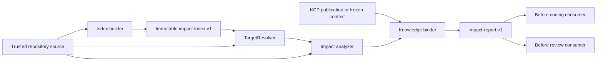

# Architecture Spine - Knowledge Control Plane Impact Analysis

## Design Paradigm

Use a layered deterministic pipeline. Repository source and the existing Knowledge Control Plane remain read-only authority inputs. Indexes and reports are immutable, revision-bound derived evidence. Consumer adapters may read evidence but do not mutate authority or freeze state.

## Invariants & Rules

### AD-1 - Authority and evidence are separate

- **Binds:** CAP-4, CAP-6, all consumers
- **Prevents:** An impact edge being interpreted as architecture, acceptance, or design authority
- **Rule:** Only ADR, Task, Contract, Decision, Freeze, and existing KCP publication/Locator contracts can make authority or semantic-acceptance decisions. Impact index/report content is evidence only.

### AD-2 - Indexes are immutable per full identity

- **Binds:** CAP-2, CAP-3, CAP-5
- **Prevents:** A report mixing source revisions or silently reusing stale dependency evidence
- **Rule:** Build `impact-index.v1.json` under `logs/ci/<YYYY-MM-DD>/impact-analysis/indexes/<index_id>/`, where `index_id` is the full content-derived identity (full commit SHA, source-manifest hash, index schema, analyzer implementation revision, and analyzer-config revision). The concrete path is immutable and consumers must verify both `index_id` and artifact SHA-256 before use; never update an index in place.

### AD-3 - Index reuse is exact-match only

- **Binds:** CAP-2, CAP-3, CAP-5
- **Prevents:** Analysis against dirty, stale, incompatible, or partially rebuilt indexes
- **Rule:** Reuse is valid only when explicit full commit SHA, verified ref trust, source hashes, source-manifest hash, index schema, analyzer implementation revision, analyzer-config revision, and clean-state evidence all match. Otherwise rebuild or return a diagnosed fail-closed status.

### AD-4 - Target resolution is exact before constrained lookup

- **Binds:** CAP-1, CAP-2
- **Prevents:** A symbol name resolving to the wrong contract, duplicate type, or unrelated Scene
- **Rule:** `TargetResolver` accepts `{type,id}` or an explicit path; exact paths resolve first. Symbols use kind-scoped exact identity; methods require namespace/type/name/signature, aliases remain kind-scoped, and resources require explicit paths. Multiple matches or overloads produce `ambiguous_target`; no heuristic best match is allowed.

### AD-5 - Analyzer owns relation semantics

- **Binds:** CAP-2, CAP-3
- **Prevents:** Independent scanners emitting incompatible edge meanings
- **Rule:** V1 edges use only `references`, `implements`, `inherits`, `consumes`, `binds`, `tests`, and `documents`, with endpoint combinations fixed by the relation matrix in `architecture-details.md`. Direction is always dependency source `from` -> depended-on/covered/documented target `to`; each edge carries endpoint kinds, source path, anchor, source hash, and a canonical dedupe key.

### AD-6 - Analysis is read-only and bounded

- **Binds:** CAP-3, CAP-5, CAP-6
- **Prevents:** Autonomous refactoring, hidden graph expansion, or unverified runtime claims
- **Rule:** `analyze_impact.py` reads source, index, and KCP artifacts only. It does not write business source, invoke an editor, infer dynamic dispatch/reflection/generated code/editor-only state/external package graphs, or claim a full call graph.

### AD-7 - KCP integration is downstream of freeze

- **Binds:** CAP-4, CAP-6
- **Prevents:** Context expansion after semantic decisions or freeze
- **Rule:** Chapter 6 flow is `dev_cli.py resume-task -> dev_cli.py chapter6-route -> freeze_knowledge_context.py -> analyze_impact.py -> run_single_task_light_lane.py/RED`. Review flow is `prepare_knowledge_context.py -> freeze_knowledge_context.py -> analyze_impact.py -> run_review_pipeline.py`. Analysis may read the frozen context or explicitly selected publication but cannot alter it, fall back from frozen context to current/LKG silently, or invoke a new semantic query implicitly.

### AD-8 - Failure states are explicit

- **Binds:** CAP-1, CAP-3, CAP-5
- **Prevents:** Treating “no discovered impact” as proof of no impact
- **Rule:** Reports use a closed status set: `ok`, `target_not_found`, `ambiguous_target`, `path_outside_repository`, `missing_index`, `stale_index`, `revision_mismatch`, `source_read_failure`, `unsupported_relation`, `index_identity_collision`, `invalid_kcp_binding`, `dirty_state`, `unsupported_target`, `invalid_manifest`, and `internal_error`; each maps to the numeric exit contract in `architecture-details.md`. Failed analysis never emits an empty successful result.

### AD-9 - Report contract is versioned and reproducible

- **Binds:** CAP-2, CAP-5, CAP-6
- **Prevents:** Consumers depending on unstable fields or non-reproducible ordering
- **Rule:** `impact-report.v1.json` contains the versioned envelope in `architecture-details.md`; paths are repository-relative, arrays are deterministically sorted, and the report binds `repository_revision`, `index_id`, index artifact SHA-256, analyzer implementation revision, and `analysis_config_revision`.

### AD-10 - Runs are isolated and atomically published

- **Binds:** CAP-2, CAP-3, CAP-5, CAP-6
- **Prevents:** Concurrent analyses overwriting reports, partial JSON being consumed, or failed runs leaving valid-looking artifacts
- **Rule:** Each local/CI analysis uses `logs/ci/<YYYY-MM-DD>/impact-analysis/<run-id>/` and publishes a validated `run-manifest.v1.json`; writers use a same-directory temporary file, fsync/close, validate, then atomic replace. Incomplete temporary artifacts are removed or retained only with explicit failure status. Consumers never read the legacy fixed report path.

### AD-11 - Operational execution is bounded

- **Binds:** CAP-3, CAP-5, CAP-6
- **Prevents:** Full-repository scans, unbounded runtime cost, or environment-specific behavior
- **Rule:** Local and CI use the same Python entrypoint and config. Scan roots and file classes are explicit, concurrent builders coordinate per `index_id`, the executable failure-code/exit map is fixed in `architecture-details.md`, and retention/garbage collection remains a named deferred policy rather than implicit deletion.

### AD-12 - Source manifest defines the indexed world

- **Binds:** CAP-2, CAP-3, CAP-5
- **Prevents:** Two builders scanning different files while claiming the same index identity
- **Rule:** The index contains a complete manifest of included repository-relative paths, byte hashes, source kinds, parser families, and exclusions. It includes project/runtime identity files (`project.godot`, `NewRouge.csproj`, `Game.Core/Game.Core.csproj`, test project files, `global.json`) and rejects unreadable, escaping, symlink-ambiguous, or manifest-incomplete inputs.

### AD-13 - KCP context lineage is explicit

- **Binds:** CAP-4, CAP-6
- **Prevents:** Binding a report to a moving `current`/LKG publication or the wrong task/review context
- **Rule:** Coding and review analysis requires an explicit frozen-context path plus its SHA-256, consumer, task identity when applicable, decision-set hash, freeze point, and KCP publication lineage. An invalid frozen context fails closed; current/LKG is never substituted silently.

### AD-14 - Risk classification is versioned and evidence-based

- **Binds:** CAP-5
- **Prevents:** Different analyzers assigning different risk to equivalent evidence
- **Rule:** A versioned risk policy maps target kind and verified impact evidence to `high`, `medium`, `low`, or `unknown`; highest applicable severity wins, unknown evidence remains `unknown`, and the report records `risk_policy_revision` and matched rule IDs.

### AD-15 - Paths and failures have stable contracts

- **Binds:** CAP-1, CAP-5, CAP-6
- **Prevents:** Path traversal, inconsistent diagnostics, or consumers treating failed JSON as success
- **Rule:** Reject absolute, drive-relative, UNC, traversal, symlink-escaping, and case-ambiguous paths with the stable failure-code/exit map in `architecture-details.md`. `status != ok` is never consumed as an empty impact set.

### Dependency direction



## Consistency Conventions

| Concern | Convention |
| --- | --- |
| Naming | `TargetResolver`, `ImpactIndex`, `ImpactAnalyzer`; JSON files use `impact-index.v1.json` and `impact-report.v1.json`. |
| Paths | Repository-relative POSIX separators in artifacts; Windows commands remain PowerShell-compatible. |
| Revisions | Use explicit full Git commit SHA plus verified ref trust and SHA-256 source bindings; no branch name alone is sufficient. |
| State | Immutable index/report outputs; fail-closed statuses; no mutation of KCP current/LKG or freeze artifacts. |
| Evidence | Every edge and knowledge reference carries a source path, symbol identity, stable ID, or hash sufficient for direct reread. |

## Stack

| Name | Version |
| --- | --- |
| Python | 3.13.x via `py -3`; CI pins the 3.13 minor line and records the resolved patch version |
| Godot | 4.5.1 .NET (runtime references only) |
| C# / .NET | C# with .NET 8 (symbol and contract sources) |
| Git | Explicit full SHA with verified checked-out ref; protected `main` verification is release-only |

## Structural Seed

```text
scripts/python/
  build_impact_index.py       # Phase 1 deliverable: deterministic source-to-index producer
  analyze_impact.py           # Phase 1 deliverable: consumer-facing resolver/analyzer/report entrypoint
  impact_analysis_config.v1.json   # ordered scan/exclusion policy (hashed into index_id)
  impact_target_aliases.v1.json    # kind-scoped resolver aliases
  _impact_*.py                # internal parsing and schema helpers
logs/ci/<YYYY-MM-DD>/impact-analysis/
  indexes/<index_id>/impact-index.v1.json
  <run-id>/impact-report.v1.json
knowledge/                     # existing KCP; read-only integration boundary
```

Detailed component/data-flow diagrams, lifecycle, resolver contract, analyzer stages, artifact schema, and integration commands are in `architecture-details.md`.

## Capability -> Architecture Map

| Capability | Lives in | Governed by |
| --- | --- | --- |
| CAP-1 target resolution | `TargetResolver` in `scripts/python/analyze_impact.py` or its internal module | AD-4, AD-8 |
| CAP-2 impact object model | versioned report model and edge validator | AD-2, AD-5, AD-9, AD-10 |
| CAP-3 dependency/runtime evidence | index builder and bounded analyzer stages | AD-3, AD-5, AD-6, AD-11 |
| CAP-4 knowledge binding | read-only KCP adapter | AD-1, AD-7 |
| CAP-5 risk/report | report emitter and risk classifier | AD-8, AD-9, AD-10, AD-11 |
| CAP-6 workflow safety | coding/review adapters | AD-1, AD-7, AD-10, AD-11 |

## Deferred

- Implement and test the Chapter 6/review adapters that add `--frozen-context`, `--impact-report`, and `--revision` forwarding; until those adapters land, this document is a design contract and existing workflows must not claim impact-aware execution.
- Pin the Windows CI setup-python action to the supported 3.13 minor line and record the resolved patch in CI evidence before implementation freeze.
- Long-term index retention/garbage collection policy; revisit at 10,000 indexes, 50 GB, or 30 production days, with the interim no-auto-delete/7-day failed-run policy in `architecture-details.md`.
- A standalone `impact-report.v1.schema.json`; decide before Phase 1 implementation freeze.
- Full runtime call graph, AST/compiler integration, external package graph, and visual graph UI; v1 evidence is intentionally bounded.
- Review sidecar contract changes; require a separate requirement, schema update, and migration evidence.
- Mandatory `--enforce` integration into Chapter 4/5/6 or Review; first complete shadow and semantic-decision pilots.
