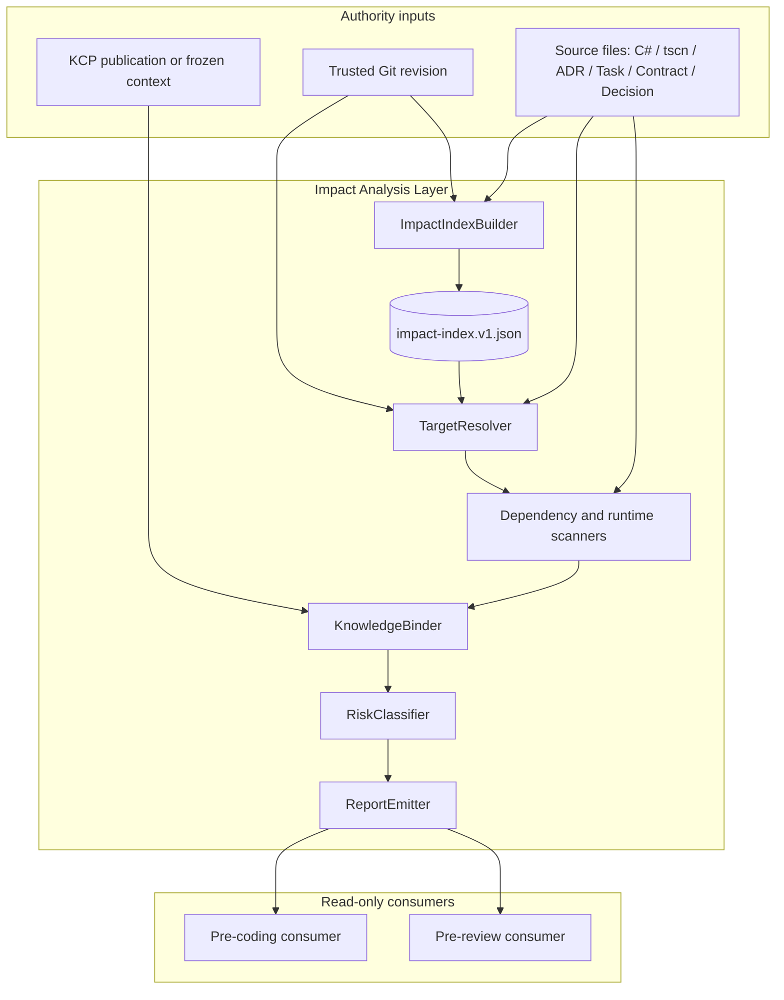
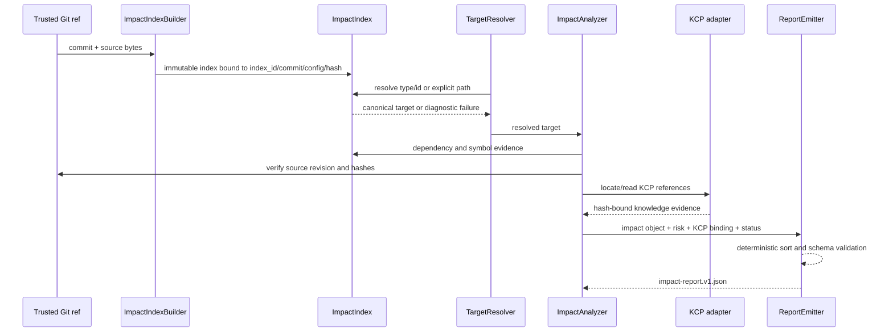

# Impact Analysis Architecture Details

## Component Diagram



## Data Flow



## A1. Impact Index Lifecycle

Lifecycle:

```text
trusted source commit + verified ref + analyzer implementation/config
  -> Index Build
  -> validate source hashes and schema
  -> logs/ci/<YYYY-MM-DD>/impact-analysis/indexes/<index_id>/impact-index.v1.json
  -> TargetResolver / Analyzer
  -> logs/ci/<YYYY-MM-DD>/impact-analysis/<run-id>/impact-report.v1.json
```

Storage rules:

- Indexes are derived evidence under `logs/ci/<YYYY-MM-DD>/impact-analysis/indexes/<index_id>/`.
- `index_id` is `idx-` plus the 64 lowercase hexadecimal SHA-256 of RFC 8785 JSON Canonicalization Scheme (JCS) bytes containing `repository_revision`, `source_manifest_sha256`, `index_schema`, `analyzer_implementation_revision`, and `analysis_config_revision`. Serialization is UTF-8 without BOM, recursively lexicographic keys, no insignificant whitespace, no NaN/Infinity, and fixed integer/decimal forms. The implementation must pass golden vectors in `scripts/python/tests/fixtures/impact-index-id-jcs-v1.json` before implementation freeze; the fixture stores input members, canonical bytes, and expected digest.
- The concrete path is immutable for an `index_id`; no mutable `current` pointer is introduced. Consumers select by `index_id` and verify the artifact SHA-256, never by commit/config directory alone. The date directory is UTC archival metadata only: lookup scans `index-manifest.v1.json` files across dates for an exact `index_id` and reuses that artifact when hashes match.
- The index records `index_id`, `repository_revision`, verified ref trust, implementation/config/schema revisions, source manifest, source hashes, and generation metadata.
- Generation metadata records the UTC timestamp, resolved Python 3.13.x version, and the canonical discovery/exclusion policy hash.
- Indexed identity inputs include `project.godot`, `NewRouge.csproj`, `Game.Core/Game.Core.csproj`, available test project files, and `global.json` in addition to C#, `.tscn`, resource, task, and knowledge sources.
- Discovery is governed by `scripts/python/impact_analysis_config.v1.json`, owned by the Impact Analysis maintainer, using a versioned ordered rule set: include repository-relative files under the declared scan roots, then apply ordered exclusions for `.git/`, build outputs, editor caches, and generated files unless explicitly marked authoritative. Each manifest entry records `path`, `sha256`, `source_kind`, `parser_family`, `parser_version`, and `included` or `excluded` with `exclusion_reason`; unsupported files are retained as deterministic `unsupported` entries with path, size, and reason. Entries are sorted by UTF-8 path bytes and then source kind. Maximum size, UTF-8-without-BOM text encoding (or declared binary), generated-file policy, and rename/delete handling are part of the hashed configuration. A missing or malformed config returns `invalid_manifest` (exit 15), never a guessed default.
- Reports retain `index_id` and the exact index artifact SHA-256 they consumed.

Each index directory also contains `index-manifest.v1.json` with `index_id`, relative artifact path, artifact SHA-256, repository revision, and UTC creation time. Each report run directory contains `run-manifest.v1.json` with `run_id`, report path/SHA-256, index identity/path/SHA-256, repository revision, KCP binding hash, status, and UTC timestamps. The index manifest is atomically published after the index; the run manifest is atomically published only after the validated report. Discovery uses these manifests rather than date-based glob ordering.

Invalidation rules:

- Explicit full commit or verified ref trust differs from the index identity.
- Any indexed source hash differs on re-read.
- Source-manifest hash, index schema, analyzer implementation revision, or analyzer-config revision differs or is unsupported.
- Trusted source is dirty or cannot be proven clean.
- Index artifact is missing, malformed, or incomplete.

On invalidation, the entrypoint may build a new index for the exact revision and identity; otherwise it returns a diagnosed failure. It must not silently analyze with stale data. Concurrent builders coordinate on `index_id` and publish atomically. Consumers discover reports through the run manifest, not by assuming the current UTC date directory. Retention and garbage collection are deferred.

## A2. TargetResolver

Input forms:

```json
{
  "type": "event",
  "id": "RewardOfferPresentedEvent"
}
```

or an explicit repository-relative path:

```json
{
  "type": "file",
  "id": "Game.Core/Contracts/Events/RewardOfferPresentedEvent.cs"
}
```

Resolution order:

1. Validate target type and normalize repository-relative path separators.
2. For `file`, `scene`, or `resource`, require an exact path and verify existence/hash.
3. For `class`, `interface`, `event`, or `contract`, query the index by exact canonical identity and kind. Canonical identity is `namespace.type` plus generic arity (`Type`1) for types; events/contracts use their fully-qualified declaration identity. An unqualified name is accepted only with an explicit scope and a unique match; otherwise return `underqualified_target`.
4. For `method`, require namespace, declaring type, method name, generic arity, and normalized parameter-type signature. Normalize aliases (`string` -> `System.String`), nullable/array/by-ref markers, generic arity, and whitespace before lookup; overloads without a complete signature are `ambiguous_target`.
5. For event/contract aliases, use an explicit versioned, kind-scoped alias table and constrain lookup to `Game.Core/Contracts/**`; aliases never cross kinds or override an exact canonical identity.
6. For `resource`, require an exact repository-relative path; do not resolve by display name or basename similarity.
7. Return a unique resolved target with canonical path, symbol identity, source hash, and `resolution_method`.
8. Return `ambiguous_target` for multiple matches/overloads and `target_not_found` for zero matches; never choose by rank or filename similarity.

Resolved target shape:

```json
{
  "kind": "event",
  "identity": "RewardOfferPresentedEvent",
  "canonical_path": "Game.Core/Contracts/Events/RewardOfferPresentedEvent.cs",
  "source_sha256": "<sha256>",
  "resolution_method": "exact-index-symbol"
}
```

Path normalization rejects absolute paths, drive-relative paths, UNC paths, `..` traversal, paths outside the repository root, symlink escapes, and case-ambiguous matches. Repository paths are case-sensitive in the artifact grammar even on Windows; a case-insensitive filesystem match is accepted only when exactly one Git-tree path has that spelling. Symbol aliases never cross target kinds.

Canonical target kinds are `file`, `scene`, `resource`, `class`, `interface`, `method`, `event`, `contract`, `system`, `symbol`, `signal`, `node`, `test_file`, `test_symbol`, `task`, `acceptance`, `adr`, and `decision`. The alias table is `scripts/python/impact_target_aliases.v1.json`, versioned and owned by the same maintainer; a missing or malformed table returns `invalid_manifest` (exit 15).

Method identity grammar is ``Namespace.Type`N::Method`M(ParameterType1,ParameterType2,...)``, where omitted generic arity is zero, parameter types use fully-qualified CLR names, arrays use `[]`, nullable value types use ``System.Nullable`1<T>``, and `ref`/`out`/`in` append `&`. Function pointers, anonymous functions, dynamic invocation, reflection targets, compiler-generated members, and unresolved generic substitutions return `unsupported_target` in v1.

## Edge Canonicalization

An edge direction is dependency source `from` -> depended-on, covered, bound, or documented target `to`. Schema validation rejects endpoint combinations outside this matrix:

| Relation | Direction | Allowed from | Allowed to | Required evidence |
| --- | --- | --- | --- | --- |
| `references` | referrer -> referenced | file, symbol | file, symbol | source path + code anchor |
| `implements` | implementation -> contract | class, interface, symbol | interface, contract, symbol | declaration anchor |
| `inherits` | subtype -> base | class, interface, symbol | class, interface, symbol | declaration anchor |
| `consumes` | consumer -> consumed contract/event | class, symbol, system, file | event, contract, symbol | subscription/handler anchor |
| `binds` | runtime owner -> bound target | scene, node, script, resource, symbol | node, script, signal, resource, symbol | `.tscn` or resource anchor |
| `tests` | test -> tested target | test file, test symbol | file, symbol, task, acceptance | test method and `Refs:` anchor |
| `documents` | knowledge document -> documented target | ADR, task, contract, decision | file, symbol, event, contract, task | document path + ID/anchor |

Each edge contains `from_kind`, `from`, `to_kind`, `to`, `relation`, `evidence_path`, `evidence_anchor`, and `evidence_sha256`. Deduplicate by the canonical tuple `(from_kind, from, to_kind, to, relation, evidence_path, evidence_anchor)` and sort by the same fields. The canonical `consumes` example is `RewardService -> RewardOfferPresentedEvent`; the reverse event-to-consumer form is invalid.

Evidence anchors use one of these grammars: `line:<start>-<end>`, `symbol:<canonical-identity>`, `json-pointer:<RFC6901-pointer>`, or `markdown:<relative-path>#<heading-slug>`. Anchors outside this grammar are `source_read_failure` rather than free-form text.

## Analyzer Pipeline

1. **Preflight:** read explicit full commit, verified ref trust, analyzer implementation/config revisions, index metadata/hash, and clean-state evidence. Canonical source bytes come from `git ls-tree -r --full-tree <revision>` plus blob reads; a worktree is accepted only when every included tracked blob hash matches that tree. Sparse-checkout omissions and submodules are unsupported in v1, ignored/untracked files are excluded unless explicitly listed by the manifest policy, and generated files are excluded unless tracked and marked authoritative.
2. **Resolve:** use `TargetResolver`; stop on ambiguity or missing target.
3. **Collect symbol evidence:** references, `using`, inheritance, interface implementation, and contract dependencies.
4. **Map tests:** identify test files/symbols and Task acceptance references from verifiable source links.
5. **Map Runtime:** parse explicit `.tscn` script, Node, signal, and resource bindings only.
6. **Bind knowledge:** read KCP candidates/publication or frozen context and re-verify source hashes.
7. **Classify risk:** choose the highest applicable level; use `unknown` when evidence is insufficient.
8. **Emit:** sort all arrays canonically, validate the report envelope, and write via same-directory temporary file plus atomic replace under `logs/ci/<YYYY-MM-DD>/impact-analysis/<run-id>/`.

Local and CI executions use the same stages, explicit scan roots, bounded file classes, and stable exit codes. The run identifier is a UUIDv4 generated per invocation; it is an isolation key only and is excluded from deterministic evidence comparisons. A failed run cleans incomplete temporary files or preserves them only inside its isolated run directory with an explicit failure marker.

## Artifact Schema

```json
{
  "schema_version": "newrouge.impact-analysis.v1",
  "status": "ok",
  "repository_revision": "<full commit>",
  "trusted_ref": "<verified ref or explicit detached revision>",
  "index_id": "<content-derived index identity>",
  "index_sha256": "<sha256>",
  "analyzer_implementation_revision": "<revision>",
  "analysis_config_revision": "<config revision>",
  "toolchain": {
    "python": "3.13.x (resolved patch recorded by runner)",
    "godot": "4.5.1.stable.mono.official"
  },
  "generated_at": "<ISO-8601>",
  "knowledge_binding": {
    "consumer": "chapter6",
    "task_id": "GM-0129",
    "frozen_context_path": "logs/ci/knowledge-context/chapter6-T29-GM-0129-v2.frozen.json",
    "frozen_context_sha256": "<sha256>",
    "decision_set_sha256": "<sha256>",
    "freeze_point": "before-red",
    "publication_generation": "<generation-id>",
    "publication_sha256": "<sha256>"
  },
  "target": {
    "kind": "event",
    "identity": "RewardOfferPresentedEvent",
    "canonical_path": "Game.Core/Contracts/Events/RewardOfferPresentedEvent.cs",
    "source_sha256": "<sha256>"
  },
  "affected_files": [],
  "affected_symbols": [],
  "impact_edges": [
    {
      "from": "RewardService",
      "from_kind": "class",
      "to": "RewardOfferPresentedEvent",
      "to_kind": "event",
      "relation": "consumes",
      "evidence_path": "Game.Core/Services/RewardService.cs",
      "evidence_anchor": "<line-or-symbol-anchor>",
      "evidence_sha256": "<sha256>"
    }
  ],
  "tests": [],
  "runtime_refs": [],
  "knowledge_refs": [],
  "risk_level": "high",
  "risk_policy_revision": "newrouge.impact-risk.v1",
  "matched_risk_rules": ["event-target"],
  "risk_reasons": ["event target"],
  "failure_reason": null
}
```

`knowledge_binding` is mandatory for every successful coding/review report and has the exact fields shown above. `consumer` is an enum (`chapter4`, `chapter5`, `chapter6`, `review`); `task_id` is required for task consumers and must be explicit JSON `null` for `review`. `decision_set_sha256`, `freeze_point`, `publication_generation`, and `publication_sha256` must be copied from or deterministically derived from the frozen artifact; omission is invalid. The validator rejects inconsistent hashes or revisions and fails closed.

Failure reports retain `schema_version`, `status`, target input, revision/config/index evidence when available, a structured `failure_reason` whose `code` is the enum above, and the corresponding non-zero exit code; they do not claim a successful empty impact set. A failed report may omit `knowledge_binding` only when the failure occurs before a binding can be read, but it must state `invalid_kcp_binding` when a supplied binding is missing or inconsistent.

## KCP Freeze And Review Integration

### Before coding

```powershell
py -3 scripts/python/freeze_knowledge_context.py `
  --bundle logs/ci/knowledge-context/<consumer>-<target>.json `
  --decisions logs/ci/knowledge-context/<consumer>-<target>.decisions.json `
  --output logs/ci/knowledge-context/<consumer>-<target>.frozen.json

py -3 scripts/python/analyze_impact.py `
  --target '{"type":"event","id":"RewardOfferPresentedEvent"}' `
  --revision <full-commit-sha> `
  --frozen-context logs/ci/knowledge-context/<consumer>-<target>.frozen.json `
  --output logs/ci/<YYYY-MM-DD>/impact-analysis/<run-id>/impact-report.v1.json
```

The analyzer reads the frozen context and its source bindings. It cannot append sources, create decisions, change freeze state, or silently substitute KCP current/LKG when the supplied freeze is invalid.

### Before review

```powershell
py -3 scripts/python/prepare_knowledge_context.py `
  --consumer review `
  --query "task <task-id> review scope architecture delivery acceptance" `
  --output logs/ci/knowledge-context/review-<task-id>.json

py -3 scripts/python/freeze_knowledge_context.py `
  --bundle logs/ci/knowledge-context/review-<task-id>.json `
  --decisions logs/ci/knowledge-context/review-<task-id>.decisions.json `
  --output logs/ci/knowledge-context/review-<task-id>.frozen.json

py -3 scripts/python/analyze_impact.py `
  --target '{"type":"file","id":"<changed-path>"}' `
  --revision <full-commit-sha> `
  --frozen-context logs/ci/knowledge-context/review-<task-id>.frozen.json `
  --output logs/ci/<YYYY-MM-DD>/impact-analysis/<run-id>/impact-report.v1.json
```

For Chapter 6, the insertion point is after `dev_cli.py resume-task` and `dev_cli.py chapter6-route`, after freeze, and before `run_single_task_light_lane.py` begins RED. For Review, report generation completes before `run_review_pipeline.py` starts.

### Adapter handoff contract

The current entrypoints do not yet expose these options; the Phase 1 adapter is an explicit implementation deliverable, not an implicit side effect of report generation. The adapter owns argument validation and forwards the exact paths:

| Caller | Required argv | Receives | Failure propagation |
| --- | --- | --- | --- |
| `scripts/python/dev_cli.py resume-task` / `chapter6-route` | `--frozen-context <path> --impact-report <path> --revision <full-sha>` | `scripts/python/run_single_task_light_lane.py` (and the Chapter 6 lane wrapper) | missing, invalid, or mismatched artifact returns the analyzer exit code; no RED run starts |
| `scripts/sc/run_review_pipeline.py` | `--frozen-context <path> --impact-report <path> --revision <full-sha>` | review stages and their existing sidecars | non-zero analyzer/binding status stops review; no sidecar is marked passed |

Adapters must verify `knowledge_binding`, revision, index SHA, and frozen-context SHA before forwarding. Retry creates a new UUIDv4 run directory; a valid immutable index/report may be reused only after exact identity and hash verification. These adapters must have tests for argv forwarding, missing files, wrong revision, and invalid frozen context. They do not alter existing sidecar schemas without a separate requirement/ADR.

Review consumes both the frozen context and the impact report as explicit paths. Any future sidecar integration requires a separate schema/requirement; the initial architecture does not modify `summary.json`, `execution-context.json`, or `latest.json`.

## Operational Envelope

- **Environments:** local Windows developer shell and Windows CI use the same Python entrypoint and JSON contracts.
- **Concurrency:** run outputs are isolated by `run-id`; index builders coordinate by `index_id`; readers consume only validated final files.
- **Time:** `generated_at` and the `<YYYY-MM-DD>` path component are UTC; discovery never relies on local wall-clock date and uses the run manifest.
- **Atomicity:** index and report publication uses temporary files in the destination directory followed by atomic replacement.
- **Bounds:** scan roots, file extensions, maximum file size, and parser families are configuration-controlled; unsupported files are reported, not guessed.
- **Cleanup:** incomplete temporary files never appear as valid reports; failed-run evidence remains inside the isolated run folder.
- **Retention:** published indexes/reports are retained without automatic deletion until a policy is approved. Revisit GC when either 10,000 index artifacts, 50 GB of impact evidence, or 30 days of production use is reached (whichever comes first). The Impact Analysis owner (maintainer of `build_impact_index.py` and `analyze_impact.py`) then proposes a retention ADR and scheduled CI-only GC, preserving every artifact referenced by a freeze, decision set, review run, or release manifest. Temporary failed-run files are retained for 7 days for diagnosis and may then be removed by that job; published artifacts are never removed by a retry.

## KCP Binding Envelope

The analyzer must record the selected KCP lineage in the report or its `knowledge_binding` object:

```json
{
  "consumer": "chapter6",
  "task_id": "GM-0129",
  "frozen_context_path": "logs/ci/knowledge-context/chapter6-T29-GM-0129-v2.frozen.json",
  "frozen_context_sha256": "<sha256>",
  "decision_set_sha256": "<sha256>",
  "freeze_point": "before-red",
  "publication_generation": "<generation-id>",
  "publication_sha256": "<sha256>"
}
```

The supplied frozen context is authoritative for the run. `frozen_context_sha256` is SHA-256 over the exact UTF-8 bytes of the frozen JSON file (including no BOM); `decision_set_sha256` is SHA-256 over the freeze command's canonicalized decision-set JSON bytes; `publication_sha256` is SHA-256 over the exact published catalog artifact bytes, and `publication_generation` is read from that artifact's top-level `generation_id`. Missing or invalid lineage fails closed; the analyzer never falls back to `current.json` or `last-known-good.json` without an explicit new request.

## Failure and Publication Contract

All commands use the following stable mapping (zero is success):

| Failure code | Exit | Meaning |
| --- | ---: | --- |
| `target_not_found` | 2 | No canonical target matched |
| `ambiguous_target` | 3 | Multiple canonical targets or incomplete overload signature |
| `path_outside_repository` | 4 | Absolute, UNC, traversal, or symlink escape |
| `missing_index` | 5 | Required index artifact is absent |
| `stale_index` | 6 | Index source/config/hash is stale |
| `revision_mismatch` | 7 | Report, index, worktree, or frozen context revisions differ |
| `source_read_failure` | 8 | Required source or manifest entry cannot be read |
| `unsupported_relation` | 9 | Relation or endpoint kind is outside the v1 matrix |
| `index_identity_collision` | 10 | Existing path contains different identity/bytes |
| `invalid_kcp_binding` | 11 | Missing or inconsistent `knowledge_binding` |
| `internal_error` | 12 | Unexpected implementation failure |
| `dirty_state` | 13 | Worktree or source tree cannot be proven clean |
| `unsupported_target` | 14 | Target kind or evidence class is outside v1 support |
| `invalid_manifest` | 15 | Discovery or alias configuration is missing or malformed |
| `lock_unavailable` | 16 | A fresh or unverifiable index lock prevents publication |

The publication protocol is Windows-safe: acquire a lock keyed by `index_id` whose JSON contains `index_id`, host, PID, process-start timestamp, and lock-created UTC timestamp. A same-host lock is stale only when the PID is absent or its process-start timestamp differs and the lock is older than 5 minutes. Cross-host locks are never auto-cleared: acquisition polls exactly five times at one-second intervals, then returns `lock_unavailable` (exit 16) and requires an operator to remove the lock after confirming the owner is gone. Write a UUIDv4-named temporary file in the destination directory, flush and close it, validate schema and hashes, then use same-volume atomic replace (`MoveFileEx`/`os.replace`). Sharing violations retry five times at 100/200/400/800/1600 ms, then return `internal_error`; the final path is never partially written. Tests must cover PID reuse, stale/fresh locks, open-destination sharing violations, retry exhaustion, and successful atomic replacement. Failed temporary files are deleted or kept only under the isolated failed run directory with a failure marker.

## Risk Policy V1

Risk is selected from verified target kind and evidence, not from arbitrary edge counts:

| Rule ID | Evidence predicate | Level |
| --- | --- | --- |
| `contract-target`, `event-target`, `save-format-target`, `core-domain-target` | Target kind/path is verified | `high` |
| `service-target`, `system-target` | Target kind/path is verified and no high rule matches | `medium` |
| `ui-only-target` | Only UI target/evidence is verified and no higher rule matches | `low` |
| `insufficient-evidence` | Target or evidence cannot satisfy a higher rule deterministically | `unknown` |

The highest matching level wins. The report records the policy revision and matched rule IDs.
